# Proyecto MASB-POT-S

 

Este proyecto consiste en la programación de un potenciostato formado por un *front-end* previamente diseñado por el Dr. Albert Álvarez, y un *back-end* basado en la *Evaluation Board* (EVB) NUCLEO-F401RE de STMicroelectronics. Esta configuración se va a realizar para llevar a cabo pruebas electroquímicas. 

El grupo que ha realizado este proyecto se llama `ecologiques` y está formado por **Helena Riesco** y **Maria Penón**.

<a href="masb-pot-s-ecologiques/Docs/assets/imgs/MARIA-PENON-BOSOM.jpg">

> Figura 1. Maria Penon i Helena Riesco.

## Contenidos <!-- omit in toc -->

- [Proyecto MASB-POT-S](#proyecto-masb-pot-s)
  - [Introducción](#introducción)
    - [Potenciostato](#Potenciostato)
    - [Voltametría cíclica](#Voltametría-cíclica)
    - [Cronoamperometría](#Cronoamperometría)
  - [Objetivos](#objetivos)
  - [Materiales](#Materiales)
    - [Placa de Evaluación](#Placa-de-Evaluación)
    - [Git y GitHub](#Git-y-GitHub)
  - [Aplicación final](#aplicación-final)
    - [Workflow implementado](#workflow-implementado)
      - [feature/chronoamperomety](#feature/chronoamperomety)
      - [feature/cyclic_voltammetry](#feature/cyclic-voltammetry)
  - [Resultados obtenidos](#Resultados-obtenidos)
    - [Cronoamperometría](#cronoamperometría)
    - [Voltametría cíclica](#voltametría_cíclica)
  - [Conclusiones](#conclusiones)
    - [Proyecto](#proyecto)
    - [Asignatura](#asignatura)
  - [Referencias](#Referencias)

## Introducción

### Potenciostato

Un potenciostato es un dispositivo electrónico necesario para controlar una celda de tres electrodos para un experimento electroanalítico. El sistema funciona manteniendo el potencial del electrodo de trabajo a un nivel constante con respecto al potencial del electrodo de referencia mediante el ajuste de la corriente en un electrodo auxiliar. Esto significa que es el responsable de polarizar la celda electroquímica a una tensión VCELL y la corriente ICELL que circula por ella. Para establecer VCELL, se va a utilizar la DAC modelo MCP4725 con dirección I2C `1100000`, pues permite generar una tensión de salida de 0 a 4V [1]. En la Figura 2 se puede ver un esquema del circuito eléctrico del potenciostato utilizado.

<a href="masb-pot-s-ecologiques/Docs/assets/imgs/circuit.jpeg">
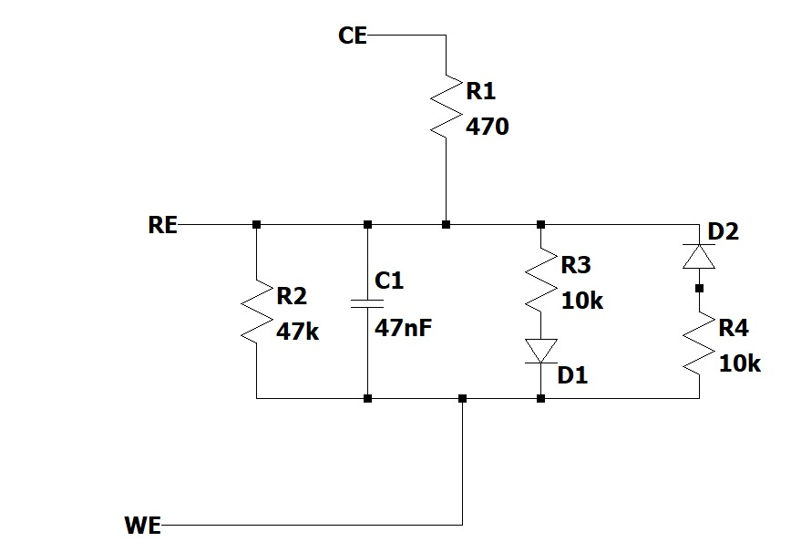 
</a>

> Figura 2. Esquema básico del potenciostato [2].

Estos dispositivos son muy usados en el mundo de la sensórica médica ya que tienen una sensibilidad muy grande.

El objetivo es que, una vez programado y a voluntad del usuario, se pueda utilizar para realizar dos medidas electroquímicas: la **voltammetría cíclica** y la **cronoamperometría**.

Son precisamente la correcta realización de éstas dos medidas uno de los objetivos de éste proyecto.

### Voltametría cíclica

Una voltametría cíclica es una técnica electroquímica de gran importancia en la que se aplica un potencial de entrada cuyo valor se va modificando entre dos valores fijos (*Ei* y *Ef*) y se obtienen los valores de corriente correspondientes.

El barrido de potencial se realiza sobre el electrodo de trabajo y se hace de manera triangular. La pendiente de esta variación se corresponde con la velocidad de barrido. 

Esta técnica es de gran utilidad, especialmente en estudios de procesos *redox*, propiedades electrocatalíticas, etc. Se utilizan tres electrodos diferentes, un *Working electrode (WE)*, *Reference electrode (RE)* y *Auxiliar electrode (AE)* o *Counter electrode (CE)*.

- WE - Corresponde al electrodo que tiene contacto con el analito, aplica el potencial deseado de manera controlada.
- RE - Debe tener un potencial conocido que actúe como referencia para poder medir el potencial del WE.
- AE - Pasa la corriente necesaria para equilibrar la corriente observada en el WE.

En la Figura 3 un ejemplo de gráficos que se pueden extraer al realizar una voltametría cíclica se pueden ver.

<a href="masb-pot-s-ecologiques/Docs/assets/imgs/voltametria.png">
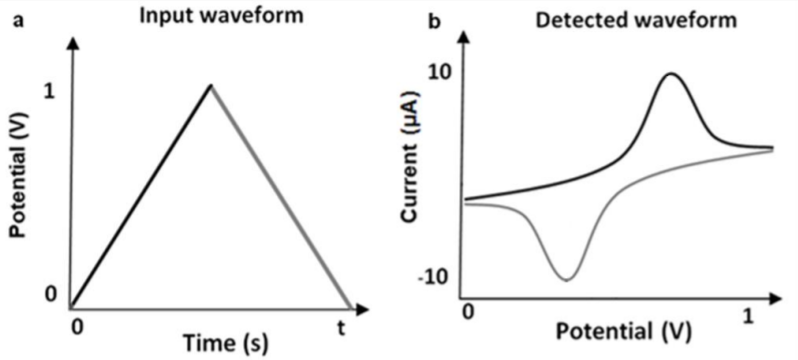
</a>

> Figura 3. a)  Forma de onda de entrada de voltametría cíclica voltaje vs tiempo b) ejemplo de una gráfica de salida corriente vs voltaje [3].

### Cronoamperometría

Una Cronoamperometría (CA) es una técnica electroquímica que transduce la actividad de las especies biológicas de una celda electroquímica en una señal de corriente que cuantifica la concentración del analito de interés. En esta técnica se aplica una señal escalón y se mide la corriente a través de la celda en función del tiempo. Una de las ventajas de esta técnica es que no requiere etiquetado de analito o bio receptor. El experimento comienza manteniendo la celda a un potencial en el que no ocurre ningún proceso faradaico. Entonces, el potencial se eleva a un valor en el cual ocurre una reacción redox. En la Figura 4 se puede observar un ejemplo de un gráfico Potencial vs Tiempo.

<a href="masb-pot-s-ecologiques/Docs/assets/imgs/cron.jpeg">
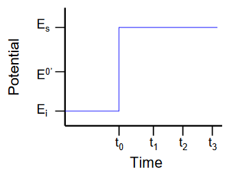
</a>

> Figura 4. Forma de onda de entrada de cronoampetrometría vs Tiempo.

## Objetivos

Los objetivos de éste proyecto se pueden resumir en los siguientes cinco puntos.

- Programar un potenciostato portable.
- Controlar la *Power Management Unit* (PMU) del módulo *front-end* del potenciostato.
- Comunicarse con la aplicación viSens-S instalada con el *host* u ordenador mediante el protocolo MASB-COMM-S.
- Realizar una voltammetría cíclica.
- Realizar una cronoamperometría.

## Materiales

Como se ha mencionado anteriormente, se va a usar:

### Placa de Evaluación

STM32 Nucleo-F401RE de STMicroelectronics, Figura 5.

<a href="masb-pot-s-ecologiques/Docs/assets/imgs/STM.png">
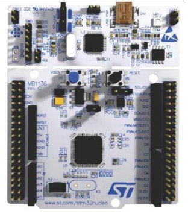
</a>

> Figura 5. NUCLEO-F401RE de STMicroelectronics [4].

Se ha utilizador esta EVB pues ofrece muchas ventajas para agilizar y simplificar el proceso de creación del código. Esto es así pues integra en la propia EVB el *debugger* (circuito electrónico necesario para programar el microcontrolador) y expone todos los pines del microcontrolador de manera que facilita las conexiones con elementos externos durante la fase de prototipaje, cosa que se ha aprovechado durante este trabajo. Durante la realización del trabajo se ha consultado el [*datasheet* del microcontrolador](https://www.st.com/resource/en/datasheet/stm32f401re.pdf), el [manual de referencia de la familia del microcontrolador](https://www.st.com/resource/en/reference_manual/dm00096844.pdf) y el [manual de usuario de las librerías HAL (*Hardware Abstraction Layer*)](https://www.st.com/resource/en/user_manual/dm00105879.pdf). Este último se ha usado para buscar las librerías HAL para usarlas en el entorno del STM32Cube IDE, que ha sido el programa utilizado para programar.

### Git y GitHub

Git es un programa de código abierto y gratuito que ofrece herramientas para desarrollar proyectos de cualquier tamaño y envergadura. Permite crear distintas líneas de trabajo independientes dentro del mismo proyecto para poder tener ramas de desarrollo, de test y operativas. Ha sido gracias a este programa que se ha podido trabajar en el desarrollo del proyecto en equipo, pues permite guardar versiones de las modificaciones realizar para poder recuperar versiones anteriores de un mismo documento [5].

GitHub, es una aplicación gratuita para la gestión de repositorios Git. Dispone de una interfaz web para tener acceso y control de las distintas colaboraciones y desarrollos del proyecto, incluyendo la opción de jerarquización de equipos, donde es necesaria la comprobación y aceptación por un project manager de las modificaciones realizadas por un desarrollador antes que se pueda unir el nuevo código, al programa principal. De este modo, se puede controlar y ir añadiendo sólo el contenido que se ha comprobado que funciona [6].

## Aplicación final

### Workflow implementado

Este proyecto se ha implementado mediante el uso de dos ramas individuales (siguiendo el formato feature/nombre-descriptivo-rama) que posteriormente se han agrupado en la rama develop. Una vez se han comprobado y arreglado errores, se han pasado los archivos a la rama master para la visualización del cliente.

> Primeramente se intentó realizar cada implementación del código en ramas distintas para un posterior merge de todo en la rama develop, pero tuvimos diversos problemas con el merge cuando las ramas ya estaban todas creadas con las estructuras y código desarrollado.
>
> La manera más automática que tuvimos para solucionarlo, pues ya sabíamos que los códigos por separado funcionaban, fue la de crear sólo dos ramas para su posterior merge al develop.

Las dos ramas creadas son `feature/chronoamperomety` y `feature/cyclic-voltammetry`. En la primera se ha hecho toda la gestión de la cronoamperometría mientras que en la segunda se ha implementado la voltammetría cíclica.

La gestión del resto de componentes (DAC, ADC, comunicación serie, *Timers*, relé y PMU) se ha realizado directamente en cada una de estas dos ramas principales. 

De esta manera, el workflow de la aplicación es el siguiente:

#### feature/chronoamperomety

Primeramente se inicializó la rama `feature/chronoamperomety` y se crearon las estructuras, setup y loop en un archivo generado dentro de la carpeta _components_, `stm32main.c`. En la Figura 6, 7 y 8, los workflows de éste archivo pueden ser observados.

<a href="masb-pot-s-ecologiques/Docs/assets/imgs/general.jpeg">
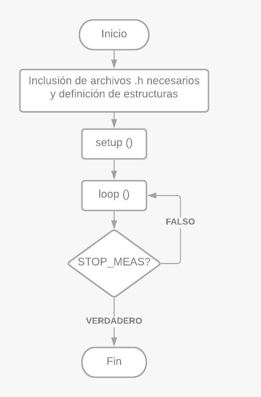
</a>

> Figura 6. Estructura general de archivo stm32main.c.

En las dos figuras siguientes, se detallan el funcionamiento de las funciones `setup()`y `loop()`.

<a href="masb-pot-s-ecologiques/Docs/assets/imgs/setup.jpeg">
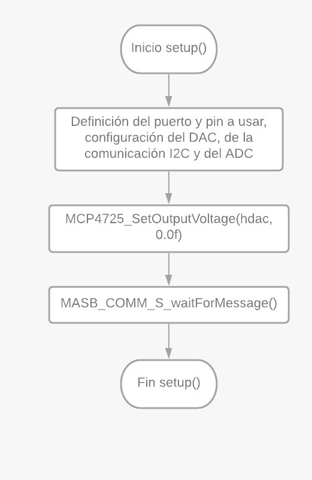
</a>

> Figura 7. Estructura de función `setup()`.

<a href="masb-pot-s-ecologiques/Docs/assets/imgs/loop.jpeg">
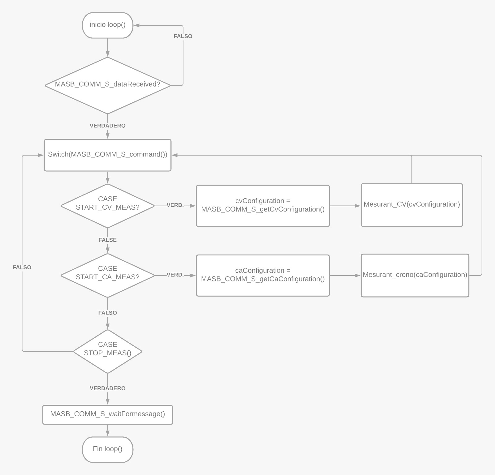
</a>

> Figura 8. Estructura de función `loop()`.

Una vez finalizado éste archivo, se ha creado un archivo `chronoamperometry.c` y su respectivo header `chronoamperometry.h`. En la siguiente Figura, Figura 9, se puede ver su implementación en un workflow.

<a href="masb-pot-s-ecologiques/Docs/assets/imgs/crono.jpeg">
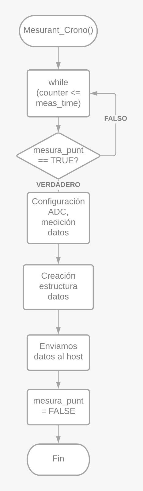
</a>

> Figura 9. Estructura general del archivo `chronoamperometry.c`.

Se puede ver que el archivo de `chronoamperometry.c` no tiene una estructura especialmente complicada, esto cambia cuando analizamos la rama `feature/cyclic_voltammetry `  y sus respectivos archivos.

#### feature/cyclic_voltammetry

En el caso de ésta rama, sólo se han creado los archivos `cyclic_voltammetry.c` y `cyclic_voltammetry.h`. En el workflow a continuación en Figura 10 se puede ver la funcionalidad del código general y en la Figura 11 se puede ver el código más específico.

> Se ha utilizado la función del Timer de la Cronoamperimetría para el contador `mesura_punt`.

<a href="masb-pot-s-ecologiques/Docs/assets/imgs/general_volta.jpeg">
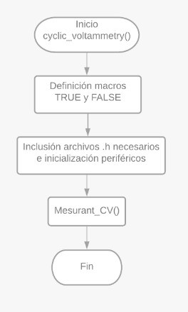
</a>

> Figura 10. Estructura general del archivo `cyclic_voltammetry.c`.

<a href="masb-pot-s-ecologiques/Docs/assets/imgs/volta.png">
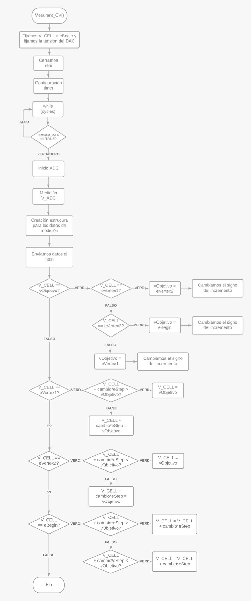
</a>

> Figura 11. Estructura del archivo `cyclic_voltammetry.c`.

Se puede ver que la dificultad ha crecido exponencialmente si comparamos los workflows de las dos ramas `feature`, esto es debido a la complejidad inherente del cálculo de la voltametría.

## Resultados obtenidos

Para poder comprobar la funcionalidad del programa desarrollado sin tener la muestra y la DAC, se ha usado el programa viSense (con un videotutorial en este [link](https://www.youtube.com/watch?v=UkXToFs8g6Y)), con el que se realiza la configuración del tipo de medida a realizar, la comunicación con la placa del microcontrolador y la visualización de los resultados obtenidos.

Para poder solventar el no disponer de la disolución, se ha conectado un potenciómetro en forma de divisor de tensión en la entrada analógica, simulando así una señal. 

<a href="masb-pot-s-ecologiques/Docs/assets/imgs/crono_prova.png">
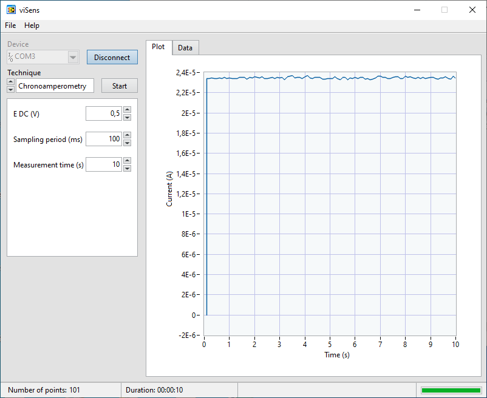
</a>

> Figura 12. Resultados obtenidos con la cronoamperimetría antes de la prueba experimental.

<a href="masb-pot-s-ecologiques/Docs/assets/imgs/volta_prova.png">
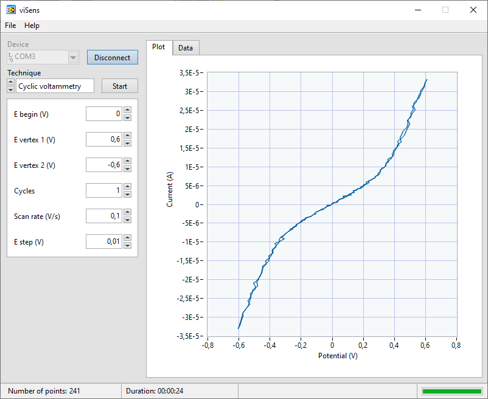
</a>

> Figura 13. Resultados obtenidos con la voltametría antes de la prueba experimental.

Los resultados han sido correctos, los datos se han enviado, la señal recibida con los _timers_ correctos y la sensibilidad aceptable durante las pruebas previas al testeado con la muestra biológica. Tanto la cronoamperimetria cómo la voltametría cíclica, han funcionado correctamente. Así pues, se ha realizado la prueba en el laboratorio. El sensor, Figura 14, se ha validado con [ferricianuro de potasio](https://es.wikipedia.org/wiki/Ferricianuro_de_potasio) a diferentes concentraciones (1mM y 5mM) en un [tampón](https://es.wikipedia.org/wiki/Tampón_químico)/*buffer* de [cloruro de potasio](https://es.wikipedia.org/wiki/Cloruro_de_potasio). Se puede apreciar la electrónica diseñada por el Dr. Álvarez conectada al STM32 Nucleo-F401RE de STMicroelectronics, y con la tira para poner el ferricianuro de potasio en la parte inferior.

<a href="masb-pot-s-ecologiques/Docs/assets/imgs/sensor.jpeg">
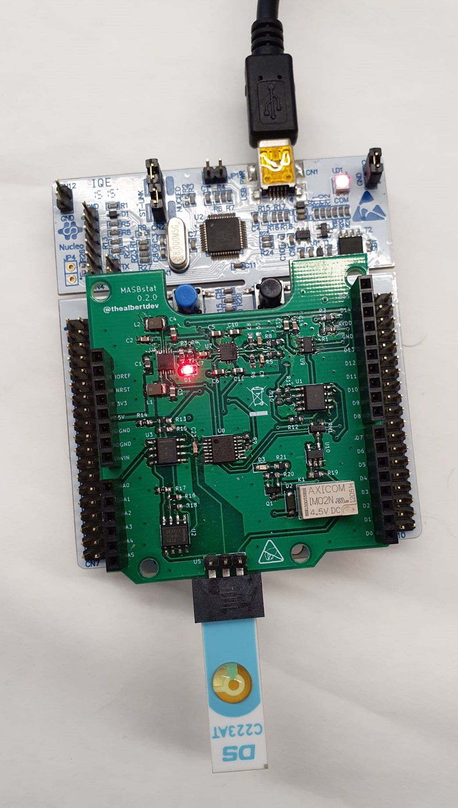
</a>

> Figura 14. Electrónica utilizada.

### Cronoamperometría

Los resultados obtenidos con la medición experimental de la cronoamperimetría se pueden ver en los gráficos a continuación.

<a href="masb-pot-s-ecologiques/Docs/assets/imgs/cronoampero.png">
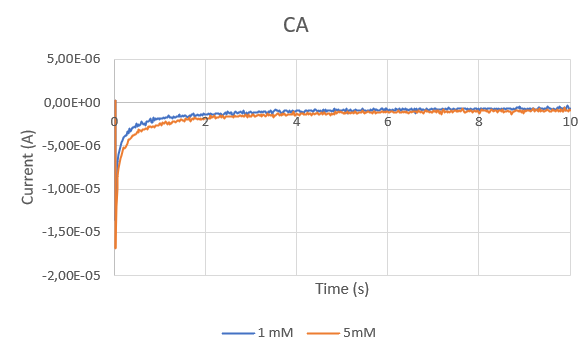
</a>

> Figura 15. Cronoamperimetría obtenida con la medición de ferricianuro de potasio a diferentes concentraciones

### Voltametría cíclica

Finalmente, los resultados obtenidos con la medición experimental de la voltametría se pueden ver en los gráficos a continuación.

<a href="masb-pot-s-ecologiques/Docs/assets/imgs/volta_experimental.png">
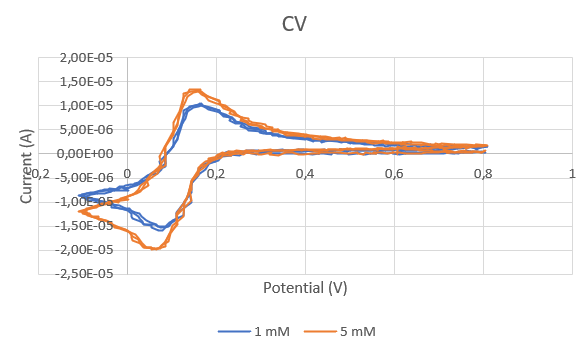
</a>

> Figura 16. Cronoamperimetría obtenida con la medición de ferricianuro de potasio a diferentes concentraciones

### 

## Conclusiones

### Proyecto

Este proyecto nos ha servido para utilizar los los distintos conocimientos
que hemos ido adquiriendo y desarrollar un código para una aplicación médica. Hemos podido aplicar los conocimientos adquiridos de cómo configurar una placa, lectura de pines, tipos de comunicación, uso de timers y su configuración, relaciones entre funciones, y mucho más. Sobre todo hemos adquirido más conocimiento sobre el uso de Git y GitHub para desarrollar programas en equipo de forma cómoda y útil, lo cual será extremadamente útil en nuestro futuro laboral. Para finalizar, nos ha dado las herramientas para saber interpretar _datasheets_ y saber encontrar la información necesaria para poder adaptarnos en distintas situaciones.

### Asignatura

Esta asignatura nos ha proporcionado las bases para, no sólo desarrollar nuestros propios proyectos de equipos médicos con microcontroladores, sino que nos ha enseñado maneras de poder trabajar en un solo proyecto en equipo.
Pese a que el conocimiento que hemos logrado adquirir sólo son las bases de la programación de microprocesadores, nos ha abierto las puertas en un ámbito que ahora está en auge.

## Referencias

[1] Potentiostat - an overview | ScienceDirect Topics. (2021). Retrieved 21 May 2021, from https://www.sciencedirect.com/topics/engineering/potentiostat.

[2] Chhorn, S., & Teeramongkonrasmee, A. (2018). A Portable USB-controlled Potentiostat for Paper-based Electrochemical Applications. *2018 15th International Conference on Electrical Engineering/Electronics, Computer, Telecommunications and Information Technology (ECTI-CON)*, 321-324.

[3] An Electrochemical Potentiostat Interface for Mobile Devices: Enabling Remote Medical Diagnostics. (2021). Retrieved 2 June 2021, from https://arxiv.org/ftp/arxiv/papers/1509/1509.08591.pdf.

[4] NUCLEO-F401RE STMicroelectronics | Mouser España. (2021). Retrieved 2 June 2021, from https://www.mouser.es/ProductDetail/STMicroelectronics/NUCLEO-F401RE?qs=fK8dlpkaUMvGeToFJ6rzdA==.

[5] About - Git. Available at: https://git-scm.com/about.

[6] What Exactly Is GitHub Anyway? | TechCrunch. Available at: https://techcrunch.com/2012/07/14/what-exactly-is-github-anyway/.
